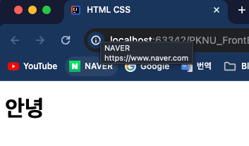
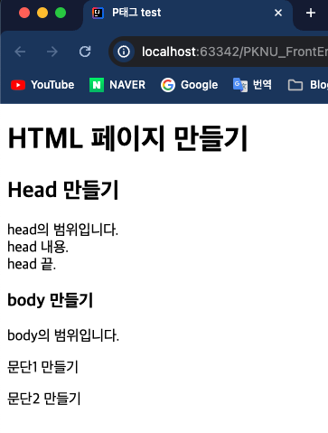

## Front-Eed 학습

### 1일차 학습내용 정리
> 1. 기본 HTML 구조
> 2. 이스케이프 문자
> 3. 다양한 태그들
---
### 1. 기본 HTML 구조
- `HTML` 의 시작은 `<html>` 태그로 시작되고 가장 끝은 `</html>`로 끝난다.
- 하지만 가장 위에는 `<!DOCTYPE html>` 을 적어 **HTML 파일이란 것을 명시**해줘야 한다.
- `<html>`태그 안에는 `<head></head>` 와 `<body></body>` 태그가 반드시 있어야한다.
- `<head>` 태그에는 HTML 문서의 정보들이 들어간다.
  - 인코딩 정보, HTML 문서 타이틀, CSS 정보 등등
- `<body>` 태그 안에는 사용자가 직접 보는 웹페이지의 요소들이 들어간다.
    ```html
    <!DOCTYPE html>
    
    <html>
    <head>
        <meta charset="UTF-8">
        <title>HTML CSS</title>
    </head>
    
    <body>
    <h1>안녕</h1>
    </body>
    
    </html>
    ```
  
---
### 2. 이스케이프 문자
- HTML 에서 공백은 스페이스바 로는 나타낼 수 없다. 이스케이프 문자를 사용하여 표현해야 한다.
- 공백 말고도 부등호나 쌍따옴표 같은 문자는 이스케이프 문자를 사용해야 한다.
  - `&lt;` : 작은 부등호 기호 : `<` 
  - `&gt;` : 큰 부등호 기호 `>`
  - `&amp;` : 엠퍼샌드 기호(`&`)`
  - `&quot;` : 쌍따옴표(`"`)
  - `&apos;` : 홀따옴표(`'`)
  - `&nbsp;` : 공백(' ')
  > 참고자료 : [이스케이프문자](https://giveme-happyending.tistory.com/33)
---
### 3. 다양한 태그들
- `<p>`태그는 HTML 에서 **단락을 정의**하는 태그이다.
- **단락은 항상 새 줄에서 시작**되며 브라우저는 **단락 앞뒤에 공백(여백)을 자동으로 추가**한다.
- 그리고 제목 태그로는 `<h1>,<h2>,...<h6>`까지 있다. 숫자가 클수록 제목크기가 크다.
- 줄 변경은 `<br>`태그로 사용한다. `<br>`태그는 닫는 태그가 없다.
  ```html
  <!DOCTYPE html>
  <html lang="en">
  
  <head>
      <meta charset="UTF-8">
      <meta name="viewport" content="width=device-width, initial-scale=1.0">
      <title>P태그 test</title>
  </head>
  
  <body>
      <h1>HTML 페이지 만들기</h1>
      <h2>Head 만들기</h2>
      <p>
          head의 범위입니다.</br>
          head 내용.<br>
          head 끝.
      </p>
      <h3>body 만들기</h3>
      <p>body의 범위입니다.</p>
      <p>문단1 만들기</p>
      <p>문단2 만들기</p>
  </body>
  
  </html>
  ```
  