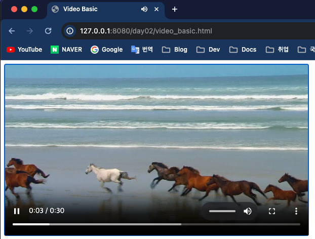
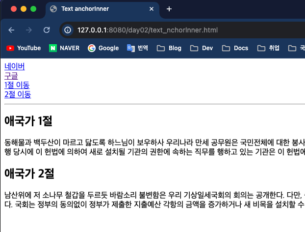
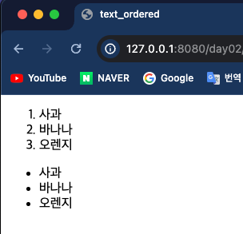
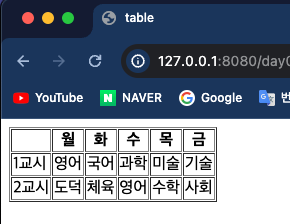
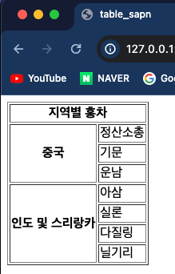

## Front-Eed 학습

### 2일차 학습내용 정리
> 1. 이미지, 오디오파일, 비디오파일 삽입 학습
> 2. `<a>`태그 웹 페이지 내부 이동
> 3. 글자 꾸미는 태그
> 4. `<ol>` , `<ul>` 태그 학습
> 5. 표 만들기
---
### 1. 이미지, 오디오파일, 비디오파일 삽입
- 오디오 파일은 `<audio>` 태그를 사용한다.
    ```html
    <audio src="오디오 파일 경로" controls="controls"></audio>
    ```
  
- 이미지 파일은 `` 태그를 사용한다.
    ```html
    
    ```
  
- 동영상 파일은 `<video>` 태그를 사용한다.
    ```html
    <video width="가로크기" controls="controls">
            <source src="동영상 파일 경로" type="동영상 파일 타입"/>
    </video>
    ```
  
---
### 2. `<a>`태그 웹 페이지 내부 이동
- `HTML` 내부에서 이동할 태그들의 id 값을 지정하고 `<a>` 태그 href 속성에 `#id값` 을 적어줘서 내부에서 이동한다.
  ```html
  <!DOCTYPE html>
  <html lang="en">
  <head>
      <meta charset="UTF-8">
      <title>Text anchorInner</title>
  </head>
  <body>
  <a href="https://naver.com">네이버</a></br>
  <a href="https://google.com">구글</a></br>
  <a href="#one">1절 이동</a></br>
  <a href="#two">2절 이동</a>
  <hr>
  <h2 id="one">애국가 1절</h2>
  <p>
      동해물과 백두산이 마르고 닳도록 하느님이 보우하사 우리나라 만세
      공무원은 국민전체에 대한 봉사자이며, 국민에 대하여 책임을 진다. 국가원로자문회의의 조직·직무범위 기타 필요한 사항은 법률로 정한다. 이 헌법시행 당시에 이 헌법에 의하여 새로 설치될 기관의 권한에 속하는 직무를 행하고 있는 기관은 이 헌법에 의하여 새로운
      기관이 설치될 때까지 존속하며 그 직무를 행한다.
  </p>
  <h2 id="two">애국가 2절</h2>
  <p>
      남산위에 저 소나무 철갑을 두르듯 바람소리 불변함은 우리 기상일세국회의 회의는 공개한다. 다만, 출석의원 과반수의 찬성이 있거나 의장이 국가의 안전보장을 위하여 필요하다고 인정할 때에는 공개하지 아니할 수 있다. 국회는 정부의 동의없이 정부가 제출한 지출예산
      각항의 금액을 증가하거나 새 비목을 설치할 수 없다. 교육의 자주성·전문성·정치적 중립성 및 대학의 자율성은 법률이 정하는 바에 의하여 보장된다.
  </p>
  </body>
  </html>
  ```
  
---
### 3. 글자 꾸미는 태그
- `<i>` 태그는 텍스트를 기울인다.
- `<small>` 태그는 텍스트를 작게한다.
- `<sub>` 태그는 글자를 해당 영역안에서 아래로 옮긴다.
- `<sup>` 태그는 글자를 해당 영역안에서 위로 옮긴다.
- `<ins>` 태그는 텍스트의 밑줄을 긋는다.
- `<del>` 태그는 텍스트의 취소선을 긋는다.
- `<strong>` 태그는 글자를 진하게 한다.
  ```html
  <!DOCTYPE html>
  <html lang="en">
  <head>
      <meta charset="UTF-8">
      <title>text_font</title>
  </head>
  <body>
  <h1>동해물과 백두산이 마르고 닳도록..</h1>
  <h1><i>동해물과 백두산이 마르고 닳도록..</i></h1>
  <h1><small>동해물과 백두산이 마르고 닳도록..</small></h1>
  <h1>동해물과 백두산이 <sub>마르고 닳도록..</sub></h1>
  <h1>동해물과 백두산이 <sup>마르고 닳도록..</sup></h1>
  <h1>
      <ins>동해물과 백두산이 마르고 닳도록..</ins>
  </h1>
  <h1>
      <del>동해물과 백두산이 마르고 닳도록..</del>
  </h1>
  <p>동해물과 백두산이 마르고 닳도록..</p>
  <p><strong>동해물과 백두산이 마르고 닳도록..</strong></p>
  </body>
  </html>
  ```
  
---
### 4. `<ol>` , `<ul>` 태그 학습
- `<ol>` 태그는 `ordered list` 의 약자로 **순서가 있는 리스트**를 생성한다.
- `<ul>` 태그는 `unordered lis`t 의 약자로 **순서가 없는 리스트**를 생성한다.
- `<ol>` , `<ul>` 태그 안에서는 `<li></li>` 태그로 리스트 항목을 적어준다.
  ```html
  <!DOCTYPE html>
  <html lang="en">
  <head>
      <meta charset="UTF-8">
      <title>text_ordered</title>
  </head>
  <body>
      <ol>
          <li>사과</li>
          <li>바나나</li>
          <li>오렌지</li>
      </ol>
  
      <ul>
          <li>사과</li>
          <li>바나나</li>
          <li>오렌지</li>
      </ul>
  </body>
  </html>
  ```
  
---
### 5. 표 만들기
- HTML 에서 표(테이블)을 만들 때는 `<table>` 태그를 선언하여 테이블을 정의한다.
- **1행(row) 를 선언**할 때는 `<tr>` 태그를 선언한다.
- `<th></th>` 태그로 **행의 제목행**을 지정할 수 있다.
- `<td></td>` 태그는 **행의 일반 컬럼**을 지정할 떄 사용한다.
- CSS가 없으면 구분선이 없는 그냥 형식만 표로 나오지만 `<table>` 태그의 `border` 속성을 이용하면 구분선을 만들 수있다.
  - 하지만 _곧 없어지는 속성이기에 css 사용을 추천한다._
  ```html
  <!DOCTYPE html>
  <html lang="en">
  <head>
      <meta charset="UTF-8">
      <title>table</title>
  </head>
  <body>
  <table border="1" cellspacing="1">
      <tr>
          <th>&nbsp;</th>
          <th>월</th>
          <th>화</th>
          <th>수</th>
          <th>목</th>
          <th>금</th>
      </tr>
      <tr>
          <td>1교시</td>
          <td>영어</td>
          <td>국어</td>
          <td>과학</td>
          <td>미술</td>
          <td>기술</td>
      </tr>
      <tr>
          <td>2교시</td>
          <td>도덕</td>
          <td>체육</td>
          <td>영어</td>
          <td>수학</td>
          <td>사회</td>
      </tr>
  </table>
  </body>
  </html>
  ```
  
- 표에서 셀 병합하는 기능도 지원한다.
- 행 병합을 할려면 `<th>` 태그에서 `rowspan` 속성을 이용하고 열 병합을 할려면 `colspan` 을 사용한다.
  ```html
  <!DOCTYPE html>
  <html lang="en">
  <head>
      <meta charset="UTF-8">
      <title>table_sapn</title>
  </head>
  <body>
  <table border="1">
      <tr>
          <th colspan="2">지역별 홍차</th>
      </tr>
      <tr>
          <th rowspan="3">중국</th>
          <td>정산소총</td>
      </tr>
      <tr><td>기문</td></tr>
      <tr><td>운남</td></tr>
      <tr>
          <th rowspan="4">인도 및 스리랑카</th>
          <td>아삼</td>
      </tr>
      <tr><td>실론</td></tr>
      <tr><td>다질링</td></tr>
      <tr><td>닐기리</td></tr>
  </table>
  </body>
  </html>
  ```
  