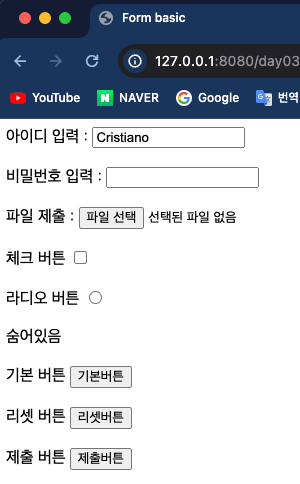
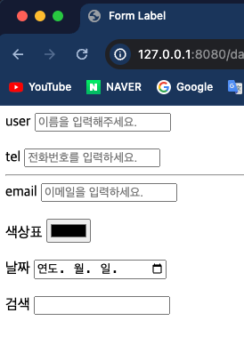
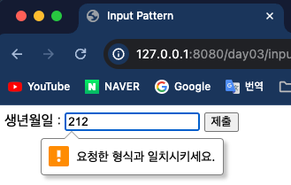
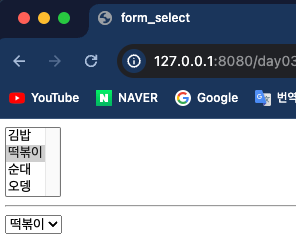
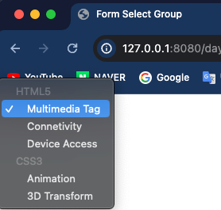

## Front-Eed 학습

### 3일차 학습내용 정리
> 1. `<input>` 태그 학습
> 2. `<form>` 태그 학습 
> 3. `<select>` 태그 학습

---
### 1. `<input>` 태그 학습
- `<input>` 태그는 말 그대로 사용자에게 입력을 받는 태그이다.
- type 속성을 이용하여 다양한 값을 입력받을 수 있다.
  - `text` : 일반 텍스트
  - `password` : 비밀번호(입력값이 보이지 않는다)
  - `file` : 파일을 선택하게 하여 입력받는다.
  - `checkbox` : 네모난 체크박스를 선택하게 한다.
  - `radio` : 동그란 라이도박스를 선택하게 한다.
  - `hidden` : 사용자에게 보이지 않는다.
  - `button` : 일반 버튼
  - `reset` : 누르면 입력값들이 초기화되는 버튼
  - `submit` : `<form>` 태그로 감싸져 있다면 서버로 전송시키는 버튼
  ```html
  <!DOCTYPE html>
  <html lang="en">
  <head>
      <meta charset="UTF-8">
      <title>Form basic</title>
  </head>
  <body>
  
  아이디 입력 :&nbsp;<input type="text" id="id" name="userId" value="Cristiano"><br><br>
  
  비밀번호 입력 :&nbsp;<input type="password" id="pw" name="userPw"><br><br>
  
  
  파일 제출 :&nbsp;<input type="file" id="file" name="myFile"><br><br>
  
  체크 버튼&nbsp;<input type="checkbox" id="check" name="isCheck"><br><br>
  
  라디오 버튼&nbsp;<input type="radio" id="radio" name="radioBtn"><br><br>
  
  숨어있음&nbsp;<input type="hidden" id="hidden" name="hideBtn"><br><br>
  
  기본 버튼&nbsp;<input type="button" id="button" value="기본버튼"><br><br>
  
  리셋 버튼&nbsp;<input type="reset" id="reset" value="리셋버튼"><br><br>
  
  제출 버튼&nbsp;<input type="submit" id="submit" value="제출버튼"><br><br>
  </body>
  </html>
  ```
  
---
### 2. `<form>` 태그 학습 
- `<input>` 태그로 사용자에게 입력을 받을려면 입력양식이 필요하다. 이 때 `<form></form>` 태그로 감싸준다.
- 그리고 `<input>` 태그는 `<label>` 태그와 한 쌍을 이루어 만들어준다.
- 이 때, `<label>` 태그의 `for` 속성값과 `<input>` 태그의 id 값을 같게 해줘야한다.
- `<label>` 태그를 사용하는 이유는 `<input>`태그의 영역이 좁기 때문이다.
- `placeholder` 속성은 힌트를 보여준다.
  ```html
  <!DOCTYPE html>
  <html lang="en">
  <head>
      <meta charset="UTF-8">
      <title>Form Label</title>
  </head>
  <body>
  <form>
      <label for="name">user</label>
      <input type="text" id="name" placeholder="이름을 입력해주세요."><br><br>
  
      <label for="tel">tel</label>
      <input type="tel" id="tel" placeholder="전화번호를 입력하세요.">
      <hr>
      <label for="email">email</label>
      <input type="email" id="email" placeholder="이메일을 입력하세요."><br><br>
  
      <label for="color">색상표</label>
      <input type="color" id="color"><br><br>
  
      <label for="date">날짜</label>
      <input type="date" id="date"><br><br>
  
      <label for="search">검색</label>
      <input type="search" id="search"><br><br>
  </form>
  </body>
  </html>
  ```
  
- 그리고 `<input>` 태그에서는 `pattern` 속성으로 입력형식을 지정할 수 있다. 이 때 **정규표현식**을 사용한다.
  ```html
  <!DOCTYPE html>
  <html lang="en">
  <head>
      <meta charset="UTF-8">
      <title>Input Pattern</title>
  </head>
  <body>
      <form>
          <label for="birthday">생년월일 :</label>
          <input type="text" id="birthday" name="birthday" pattern="[0-9]{6}">
  
          <input type="submit">
      </form>
  </body>
  </html>
  ```
  
---
### 3. `select` 태그 학습
- `<select>`태그는 말 그대로 여러 선택값을 보여주는 태그이다.
- <select> 태그 안에서 <option></option>태그로 목록을 지정한다.
- 이 때, `selected` 속성을 사용하면 먼저 선택되어진다.
- `multiple` 속성값은 모든 목록들을 펼쳐지게 한다.
  ```html
  <!doctype html>
  <html lang="en">
  <head>
      <meta charset="UTF-8">
      <title>form_select</title>
  </head>
  <body>
      <form>
          <select multiple="multiple">
              <option>김밥</option>
              <option selected>떡볶이</option>
              <option>순대</option>
              <option>오뎅</option>
          </select>
      </form>
      <hr>
      <form>
          <select>
              <option>김밥</option>
              <option selected>떡볶이</option>
              <option>순대</option>
              <option>오뎅</option>
          </select>
      </form>
  </body>
  </html>
  ```
  
- 목록들을 **내부에 그룹으로 나누어** 사용할 때는 `<optgroup>` 을 사용하고 `label` 속성으로 그룹명을 지정할 수 있다.
- `value` 속성값은 서버에 전송시 날아가는 데이터이름이다.
  ```html
  <!DOCTYPE html>
  <html lang="en">
  <head>
      <meta charset="UTF-8">
      <title>Form Select Group</title>
  </head>
  <body>
  <select>
      <optgroup label="HTML5">
          <option value="data_1">Multimedia Tag</option>
          <option value="data_2">Connetivity</option>
          <option value="data_3">Device Access</option>
      </optgroup>
      <optgroup label="CSS3">
          <option>Animation</option>
          <option>3D Transform</option>
      </optgroup>
  </select>
  </body>
  </html>
  ```
  