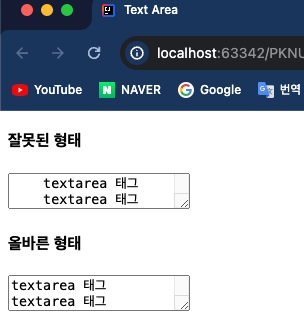
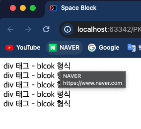
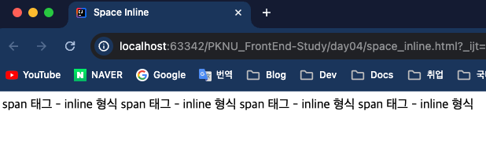
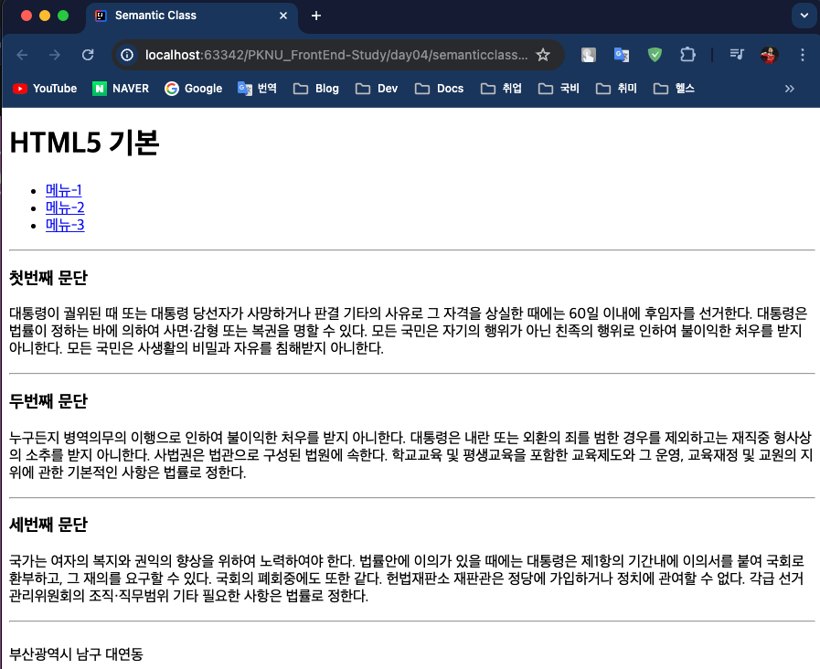
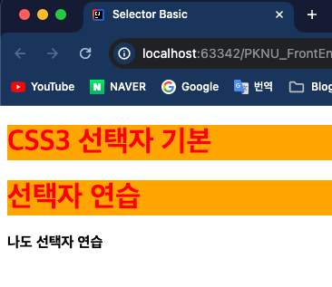
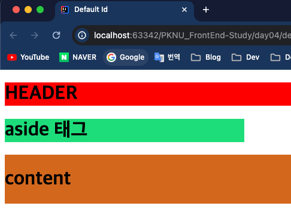
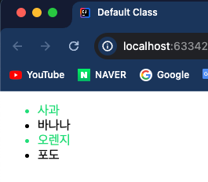

## Front-Eed 학습

### 4일차 학습내용 정리
> 1. `<textarea>` 학습
> 2. 블록요소, 인라인요소, 인라인 블럭 요소 학습
> 3. 시멘틱태그 학습
> 4. CSS 기초
---
### 1. `<textarea>` 학습
- `<textarea>` 태그는 여러 줄의 텍스트 입력 컨트롤을 정의한다.
- 주로 댓글이나 리뷰와 같은 사용자 입력을 수집하기 위해 양식에서 자주 사용된다.
    > [참고자료 : w3schools](https://www.w3schools.com/tags/tag_textarea.asp)
    ```html
    <!DOCTYPE html>
    <html lang="en">
    <head>
        <meta charset="UTF-8">
        <title>Text Area</title>
    </head>
    <body>
    <h4>잘못된 형태</h4>
    <textarea>
        textarea 태그
        textarea 태그
    </textarea>
    <h4>올바른 형태</h4>
    <textarea>
    textarea 태그 textarea 태그
    textarea 태그
    </textarea>
    </body>
    </html>
    
    <!--
        <textarea> 태그 안에 글을 넣을때는 들여쓰기를 하면 들여쓰기 된 상태로 웹 화면에 뜬다.
    -->
    ```
  
---
### 2. 블록요소, 인라인요소, 인라인 블럭 요소 학습
- 태그 성질에 따라 `블록요소`, `인라인요소`, `인라인 블럭 요소`로 나뉜다.

#### 블럭요소 태그
- `<html>` , `<body>` , `<div>` , `<p>` , `<ul>` 등등이 있다.
- **기본 가로 공간**의 크기가 부모태그와 동일하게 인식한다.
- 연속해서 작성하면 세로로 나열된다.
- **공간값(width, height)** 이 적용된다.
    ```html
    <!DOCTYPE html>
    <html lang="en">
    <head>
        <meta charset="UTF-8">
        <title>Space Block</title>
    </head>
    <body>
        <div>div 태그 - blcok 형식</div>
        <div>div 태그 - blcok 형식</div>
        <div>div 태그 - blcok 형식</div>
        <div>div 태그 - blcok 형식</div>
        <div>div 태그 - blcok 형식</div>
    </body>
    </html>
    ```
  
#### 인라인요소 태그
- `<a>` , `<span>` , `<strong>` , `<i>` , `<em>` 등등이 있다.
- 기본 가로 공간의 크기가 **안쪽에 포함된 내용만큼만 인식**
- 연속해서 작성하면 가로로 나열된다.
- **공간값(width, height)** 이 적용안된다.
    ```html
    <!DOCTYPE html>
    <html lang="en">
    <head>
        <meta charset="UTF-8">
        <title>Space Inline</title>
    </head>
    <body>
        <span>span 태그 - inline 형식</span>
        <span>span 태그 - inline 형식</span>
        <span>span 태그 - inline 형식</span>
        <span>span 태그 - inline 형식</span>
    </body>
    </html>
    ```
  
#### 인라인 블록요소 태그
- `` , `<input>` , `<button>` 등등
- 기본 가로 공간의 크기가 **안쪽에 포함된 내용만큼 인식**
- 연속해서 작성하면 가로로 나열된다.
- `공간값(width, height)` 이 적용된다.
---
### 3. 시멘틱태그 학습
- 시멘틱 태그(Semantic Tag)는 내용을 명확하게 정의하는 태그이다.
- 예를 들면 `<div>` 나 `<span>` 은 내용을 들여다보기 전에는 태그만 봐서 무슨 내용인지 알 수없다.
- 하지만 `<form>` , `<table>` 과 같은 태그들은 내용을 명확하게 정의한다.
- HTML5 부터는 브라우저와 개발자 모두에게 의미를 명확하게 설명하기 위해 시맨틱 태그를 지원한다.

#### 대표적인 시멘틱 태그
- `<header>` : 머리말
- `<nav>` : 메뉴바 or 네비게이션바
- `<aside>` : 사이드바
- `<section>` : 제목별로 나누는 컨텐츠 영역
- `<article>` : 개별 컨텐츠를 나누는 영역
- `<footer>` : 사이트 맨 아래 저자, 저작권 정보 등 웹페이지의 정보를 기입하는 영역
  ```html
  <!DOCTYPE html>
  <html lang="en">
  <head>
      <meta charset="UTF-8">
      <title>Semantic Class</title>
  </head>
  <body>
  <header>
      <div>
          <h1>HTML5 기본</h1>
      </div>
  </header>
  <nav>
      <ul>
          <li><a href="#div1">메뉴-1</a></li>
          <li><a href="#div2">메뉴-2</a></li>
          <li><a href="#div3">메뉴-3</a></li>
      </ul>
  </nav>
  <hr>
  <section>
      <article id="div1">
          <h3>첫번째 문단</h3>
          <p>
              대통령이 궐위된 때 또는 대통령 당선자가 사망하거나 판결 기타의 사유로 그 자격을 상실한 때에는 60일 이내에 후임자를 선거한다. 대통령은 법률이 정하는 바에 의하여 사면·감형 또는 복권을 명할 수 있다. 모든 국민은 자기의 행위가 아닌 친족의
              행위로
              인하여 불이익한 처우를 받지 아니한다. 모든 국민은 사생활의 비밀과 자유를 침해받지 아니한다.
          </p>
      </article>
      <hr>
      <article id="div2">
          <h3>두번째 문단</h3>
          <p>
              누구든지 병역의무의 이행으로 인하여 불이익한 처우를 받지 아니한다. 대통령은 내란 또는 외환의 죄를 범한 경우를 제외하고는 재직중 형사상의 소추를 받지 아니한다. 사법권은 법관으로 구성된 법원에 속한다. 학교교육 및 평생교육을 포함한 교육제도와 그
              운영,
              교육재정 및 교원의 지위에 관한 기본적인 사항은 법률로 정한다.
          </p>
      </article>
      <hr>
      <article id="div3">
          <h3>세번째 문단</h3>
          <p>
              국가는 여자의 복지와 권익의 향상을 위하여 노력하여야 한다. 법률안에 이의가 있을 때에는 대통령은 제1항의 기간내에 이의서를 붙여 국회로 환부하고, 그 재의를 요구할 수 있다. 국회의 폐회중에도 또한 같다. 헌법재판소 재판관은 정당에 가입하거나
              정치에
              관여할 수 없다. 각급 선거관리위원회의 조직·직무범위 기타 필요한 사항은 법률로 정한다.
          </p>
      </article>
  </section>
  <hr>
  <footer>
      <br>부산광역시 남구 대연동</span>
  </footer>
  </body>
  </html>
  ```
  
---
### 4. CSS 기초
- `CSS(Cascading Style Sheets)`는 HTML 요소에 디자인, 레이아웃 및 디스플레이 변형 등 ***웹 페이지의 스타일을 정의하는데 사용***한다.
- CSS 는 기본적으로 아래와 같은 구조를 가진다.
  ```css
  Selector {
    Property : Value;
    Property : Value;
    ....
  }
  ```
  - `선택자(Selector)` 에는 태그명, ID값, Class값이 들어올 수 있다.
  - `스타일 속성(Property)`에는 color , background-color 등등 스타일 속성명이 들어간다.
  - `스타일 값(Value)`은 스타일 속성에 맞는 값들이 들어간다.

#### 태그 선택자
- 태그 선택자는 말 그대로 선택자 자리에 `태그명(div, h1 등)`이 들어간다.
  ```html
  <!DOCTYPE html>
  <html lang="en">
  <head>
      <meta charset="UTF-8">
      <title>Selector Basic</title>
      <style>
          h1 {
              color: red;
              background-color: orange;
          }
      </style>
  </head>
  <body>
  <h1>CSS3 선택자 기본</h1>
  <h1>선택자 연습</h1>
  <h4>나도 선택자 연습</h4>
  </body>
  </html>
  ```
  
#### ID 선택자
- ID 선택자는 선택자에 ID값이 들어가는데, ID값 앞에 `#` 이 붙는다.
  ```html
  <!DOCTYPE html>
  <html lang="en">
  <head>
      <meta charset="UTF-8">
      <title>Default Id</title>
      <style>
          #header {
              width: 800px;
              margin: 0;
              background: red;
          }
  
          #wrap {
              width: 400px;
              margin: 0;
              background-color: #1edd7a;
          }
  
          #content {
              width: 600px;
              float: left;
              background-color: chocolate;
          }
      </style>
  </head>
  <body>
  <div id="header">
      <h1>HEADER</h1>
  </div>
  
  <div id="wrap">
      <h1>aside 태그</h1>
  </div>
  
  <div id="content">
      <h1>content</h1>
  </div>
  </body>
  </html>
  ```
  
#### 클래스 선택자
- 클래스 선택자는 클래스명 앞에 `.` 을 붙여준다.
- 클래스값은 중복을 허용하기 때문에 같은 스타일을 지정하고 싶은 곳에 클래스값을 같게 해주면 된다.
  ```html
  <!DOCTYPE html>
  <html lang="en">
  <head>
      <meta charset="UTF-8">
      <title>Default Class</title>
      <style>
          .select{
              color: #1edd7a;
          }
      </style>
  </head>
  <body>
      <ul>
          <li class="select">사과</li>
          <li>바나나</li>
          <li class="select">오렌지</li>
          <li>포도</li>
      </ul>
  </body>
  </html>
  ```
  