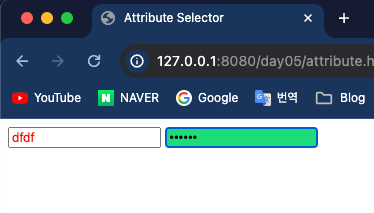
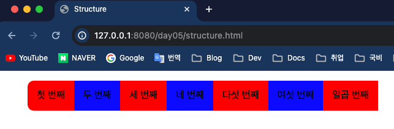

## Front-Eed 학습

### 5일차 학습내용 정리
> 1. 속성 선택자
> 2. 자식 선택자
> 3. 테이블태그 CSS 적용
> 4. 반응 선택자
> 5. 구조 선택자
> 6. 상태 선택자
---
### 속성 선택자 
- `선택자(Selector)`에는 **태그선택자**, **ID선택자**, **Class 선택자**를 주로 쓰지만 *태그의 속성명*으로 선택자를 쓸 수 있다.
    ```html
    <!DOCTYPE html>
    <html lang="en">
    <head>
        <meta charset="UTF-8">
        <title>Attribute Selector</title>
        <style>
            input[type="text"] {
                color: red;
            }
    
            input[type="password"]{
                background-color: #1edd7a;
            }
        </style>
    </head>
    <body>
    <form>
        <input type="text">
        <input type="password">
    </form>
    </body>
    </html>
    ```
  
---
### 2. 자식 선택자
- HTML 를 사용하다 보면 특정 태그 안에 있는 태그를 넣어 작성할 때가 있다.
- 이 때 특정 태그 안에 있는 자식태그에 스타일을 적용할 때는 `>` 를 사용한다.
  - id값이 `header` 인 태그의 자식 태그중 `<h1>` 에만 스타일을 지정할 때는 `#header > h1` 을 사용한다.
  - `<ul>` 태그 안에 있는 `<li>`태그도 자식 태그이기 때문에 `>`를 사용한다.
      ```html
      <!DOCTYPE html>
      <html lang="en">
      <head>
          <meta charset="UTF-8">
          <title>Selector Desc</title>
          <style>
              #header > h1{
                  color: darkred;
              }
    
              #section > li {
                  color:olivedrab;
              }
          </style>
      </head>
      <body>
      <div id="header">
          <h1>CSS 선택자 기본</h1>
          <h2>기본 선택자</h2>
    
          <ul id="section">
              <li>전체 선택자</li>
              <li>태그 선택자</li>
              <li>아이디 선택자</li>
              <li>클래스 선택자</li>
          </ul>
      </div>
      </body>
      </html>
      ```
    
  - 태그 안에 한종류의 태그가 아닌 자식태그의 자식태그가 있을 때 후손 태그에 스타일을 적용할려면 후손 선택자를 이용해야 한다.
      - 예를 들어 id값이 `header` 인 태그에 `<h1>` 태그와 `<div>`태그가 있고 `<div>`태그 안에 또 `<h1>`태그가 있다고 하자.
      - 이 때 id값이 `header` 인 태그 안에 모든 `<h1>` 태그에 스타일을 지정할 때 후손선택자를 사용한다.
      ```html
      <!DOCTYPE html>
      <html lang="en">
      <head>
          <meta charset="UTF-8">
          <title>Selector Desc 2</title>
          <style>
              /*id 가 header 와 자식 뿐 아니라 모든 h1 태그에 스타일 적용*/
              #header h1{
                  color: red;
              }
    
              #section h1{
                  color: orange;
              }
          </style>
      </head>
      <body>
      <div id="header">
          <h1 class="title">후손 선택자</h1>
          <div id="nav">
              <h1>Navigation</h1>
              <h2>네비게이션</h2>
          </div>
      </div>
      <div id="section">
          <h1 class="title">애국가</h1>
          <p>
              동해물과 백두산이 마르고 닳도록
          <p>하느님이 보우하사 우리나라 만세
          </p>
      </div>
      </body>
      </html>
      ```
    
---
### 3. 테이블태그 CSS 적용
- 테이블 태그에 스타일을 지정할 때 조심해야 한다.
- 보통 `<table>` 태그를 선언하고 각 행은 `<tr>`로 선언하고 제목열이면 `<th>` , 그냥 열이라면 `<td>` 를 사용하면 테이블이 생성된다.
- 하지만 원래는 제목행은 `<thead>`로 감싸주고 일반행들은 `<tbody>` 그리고 맨 마지막 행(계산결과값 등)에는 `<tfoot>` 태그를 적어줘야 한다. 하지만 **생략해도 자동으로 만들어주기** 때문에 신경쓰지 않았다.
- 만약 **자식선택자를 통해 스타일을 적용한다면 생략되었던 태그들을 반드시 적어줘야 한다.**
    ```html
    <!DOCTYPE html>
    <html lang="en">
    <head>
        <meta charset="UTF-8">
        <title>Selector Desc Table</title>
        <style>
            table > tbody {
                background-color: red;
            }
        </style>
    </head>
    <body>
    <table border="1">
        <thead>
        <tr>
            <th>이름</th>
            <th>지역</th>
        </tr>
        </thead>
        <tbody>
        <tr>
            <td>홍길동</td>
            <td>부산 남구 용호동</td>
        </tr>
        </tbody>
    </table>
    </body>
    </html>
    ```
  
---
### 4. 반응 선택자
- 반응 선택자는 사용자의 반응에 따라 스타일을 지정할 떄 사용하는 선택자이다.
  - `태그명:hover` : 사용자가 태그위에 마우스를 올렸을 때
  - `태그명:visited` : 사용자가 link를 클릭하여 방문하였을 때
  - `태그명:active` : 사용자가 클릭할 때
    ```html
    <!DOCTYPE html>
    <html lang="en">
    <head>
        <meta charset="UTF-8">
        <title>Selector Action</title>
        <style>
            h1:hover {
                color: red;
            }
    
            a:visited {
                color: green;
                font-size: 40px;
            }
    
            h3:active {
                color: blue;
            }
        </style>
    </head>
    <body>
    <h1>hover : 마우스를 올렸을 때</h1>
    <h2><a href="https://github.com/LegdayDev" target="_blank">visited : link를 클릭하여 방문하였을 때</a></h2>
    <h3>active : 클릭했을 때</h3>
    </body>
    </html>
    ```
    
---
### 5. 구조 선택자
- 특정 위치에 있는 태그들에 스타일을 적용할 때 쓰는 선택자이다.
  - `태그명:first-child` : 여러 태그중 첫 번째 태그
  - `태그명:last-child` : 여러 태그중 마지막 태그
  - `태그명:nth-child(수열 또는 순번)`: 여러 태그중 수열 또는 순번을 지정한다.
    - 수열이 `2n` 이라면 2,4,6,8,...2N 번째 태그들만 적용된다.
    - 홀수 또는 짝수 태그에만 적용시킬려면 `odd` , `even` 을 넣어주면 된다.
    ```html
    <!DOCTYPE html>
    <html lang="en">
    <head>
        <meta charset="UTF-8">
        <title>Structure</title>
        <style>
            li {
                list-style: none;
                float: left;
                padding: 15px;
            }
    
            li:first-child {
                border-radius: 10px 0 0 10px;
                background-color: #1edd7a;
            }
    
            li:nth-child(even){
                background-color: blue;
            }
    
            li:nth-child(odd){
                background-color: red;
            }
        </style>
    </head>
    <body>
    <ul>
        <li>첫 번째</li>
        <li>두 번째</li>
        <li>세 번째</li>
        <li>네 번째</li>
        <li>다섯 번째</li>
        <li>여섯 번째</li>
        <li>일곱 번째</li>
    </ul>
    </body>
    </html>
    ```
    

#### 참고 > 그외 태그 속성
- `<li>` 태그들을 쓸 때 목록 앞에 오는 기호들을 바꿀 수 있다.
- `list-style` 이라는 속성명을 통해 변경한다.
  - `disc` : 기본 원형 블릿마커
  - `decimal` : 1,2,....
  - `circle` : `◦`
  - `square` : `■`
- 요소의 테두리를 지정할 수 있다.
- `boder-radius` 속성을 이용하고 총 4개의 값을 받는다(좌상, 우상, 우하, 좌하)
---
### 6. 상태 선택자
- `<input>` 태그와 같이 입력 양식의 상태를 선택할 때 상태 선택자를 사용한다.
  - `태그명:checked` : 체크 상태인 input 태그를 선택
  - `태그명:focus` : input 태그 클릭시
  - `태그명:enabled` : 사용가능한 input
  - `태그명:disabled` : 사용불가능한 input
    ```html
    <!DOCTYPE html>
    <html lang="en">
    <head>
        <meta charset="UTF-8">
        <title>State</title>
        <style>
            input:enabled {
                background-color: red
            }
    
            input:disabled {
                background-color: gray;
            }
    
            input:focus {
                background-color: blue;
            }
    
        </style>
    </head>
    <body>
    <h2>기본 input</h2>
    <input value="가능">
    
    <h2>disabled input</h2>
    <input disabled="disabled" value="불가능">
    
    <h2>focus input</h2>
    <input value="불가능">
    
    </body>
    </html>
    ```
    