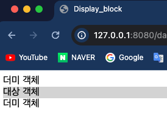

## Front-Eed 학습

### 6일차 학습내용 정리
> 1. CSS - 폰트 크기
> 2. CSS 우선순위
> 3. 영역 설정 
> 4. display 속성
> 5. background 이미지
---
### 1. CSS - 폰트 크기
- CSS 로 폰트 크기를 설정할 때는 `font-size` 속성을 이용한다.
- 속성값에는 2 종류의 속성값이 있다.
  1. `%` : 기본으로 설정된 크기를 기준으로 상대적인 크기를 나타낸다.
  2. `em` : 배수를 나타낸다(100% = 1em , 150% = 1.5em)
  3. `px` : 픽셀(Pixel) 단위로 된다.(1px = 0.265mm이며 절대적인 길이 단위이다.)
    ```html
    <!DOCTYPE html>
    <html lang="en">
    <head>
        <meta charset="UTF-8">
        <title>Pixel Size</title>
        <style>
            p:nth-child(1)
            p:nth-child(2) {
                font-size: 16px; /*기본값*/
            }
    
            p:nth-child(3) {
                font-size: 24px;
            }
    
            p:nth-child(4) {
                font-size: 32px;
            }
        </style>
    </head>
    <body>
    <p>동해물과 백수단이 마르고 닳도록</p>
    <p>동해물과 백두산이 마르고 닳도록</p>
    <p>동해물과 백두산이 마르고 닳도록</p>
    <p>동해물과 백두산이 마르고 닳도록</p>
    </body>
    </html>
    ```
  
---
### 2. CSS 우선순위
- CSS 로 스타일을 적용할 때 그게 6가지의 우선순위로 나뉜다.
  1. !important
  2. 인라인 속성
  3. #id 로 지정한 속성
  4. .class 로 지정한 속성
  5. 태그이름으로 지정한 속성
  6. 상위 객체에 의해 상속된 속성

- !important 는 속성에 속성값을 지정하고 !important 를 적어주면 된다.
  - 예) `important-block { color:red; !important }`
- 인라인 속성은 HTML 태그에 직접 style 을 적어주는 것이다.
  - 예) `<span style="font-size:20px;>temp</span>`
    ```html
    <!DOCTYPE html>
    <html lang="en">
    <head>
        <meta charset="UTF-8">
        <title>Cascading</title>
        <style>
            h1 {
                color: green;
            }
    
            p {
                color: blue;
            }
    
            h1{
                color: brown; !important;
            }
    
        </style>
    </head>
    <body>
    <h1>레드향</h1>
    <p style="color: red">껍질에 붉은 빛이 돌아 레드향이라 불린다.</p>
    <p>레드향은 한라봉과 귤을 교배한 것으로</p>
    <p>일반 귤보다 2 ~ 3배 크고, 과육이 불고 통통하다.</p>
    </body>
    </html>
    ```
    
---
### 영역 설정
- 기본적으로 CSS 에서 영역 설정을 하기 위해 `width` , `height` 속성을 사용한다.
    ```html
    <!DOCTYPE html>
    <html lang="en">
    <head>
        <meta charset="UTF-8">
        <title>Box_Width&Height</title>
        <style>
            div {
                background-color: red;
                width: 100px;
                height: 100px;
            }
        </style>
    </head>
    <body>
    <div></div>
    </body>
    </html>
    ```
  
- 그리고 콘텐츠의 크기는 `width` 와 `height` 으로만 결정되는게 아니다.
- `margin` 값과 `padding` 값에 의해 컨텐츠의 크기가 결정된다.
  - `margin`: Object 와 화면과의 여백(외부여백)
  - `padding`: Object 내의 내부여백
  
    - [출처](https://velog.io/@hyejin4169/CSS-margin-padding-%EC%B0%A8%EC%9D%B4%EC%A0%90%EA%B3%BC-%EC%82%AC%EC%9A%A9%EB%B2%95-%EC%A0%95%EB%A6%AC)
- `margin` 과 `padding` 값을 줄 때 3가지 경우가 있다.
  1. 속성 4개 : 순서는 좌상 , 우상, 우하, 좌하 이다. 
  2. 속성 2개 : 첫번째 값이 위아래, 두번째 값이 좌우이다. 
  3. 속성 1개 : 모든 방향
    ```html
    <!DOCTYPE html>
    <html lang="en">
    <head>
        <meta charset="UTF-8">
        <title>Box_Margin</title>
        <style>
            #outer {
                background-color: red;
                width: 100px;
                height: 100px;
    
                margin: 30px 30px 30px 30px;
                padding: 30px 30px 30px 30px;
            }
    
        </style>
    </head>
    <body>
    <div id="outer"></div>
    </body>
    </html>
    ```
  
- 영역의 테두리를 정할 때는 border 라는 속성을 이용한다.
  - border-width : 테두리의 넓이를 설정한다.thick/dashed/solid/dotted 
  - border-style : 4개영역(상하좌우)의 선 스타일을 지정한다.
  - border-color : 요소의 테두리 색깔을 지정한다.
  - border : 테두리 넓이, 선 스타일 , 속성을 한꺼번에 지정할 수 있다.
  - border-bottom/top/right/left : 요소의 상하좌우 중 하나의 스타일 지정할 수 있다.
  - border-radius : 테두리의 모서리를 둥글게 해준다.
    ```html
    <!DOCTYPE html>
    <html lang="en">
    <head>
        <meta charset="UTF-8">
        <title>Border_radius</title>
        <style>
            .box {
                width: 150px;
                height: 80px;
                background-color: red;
                border: 2px;
            }
    
            #box1 {
                border-radius: 20px;
            }
    
            #box2 {
                width: 80px;
                border-radius: 50px;
            }
    
        </style>
    </head>
    <body>
    <div class="box"></div><br>
    <div id="box1" class="box"></div>
    <br>
    <div id="box2" class="box"></div>
    <br>
    <div id="box3" class="box"></div>
    <br>
    </body>
    </html>
    ```
    
---
### 4. display 속성
- `display` 속성은 요소를 어떻게 보여줄지를 결정한다.
- 크게 4가지 속성값이 쓰인다.
  1. `none` : 보이지 않음
  2. `block` : 블록 박스
  3. `inline` : 인라인 박스
  4. `inline-block` : block 과 inline 의 중간 형태

#### none 과 visibility
- `display : none;` 으로 설정하면 **화면에 보이지도 않고 공간도 차지하지 않는다.**
  ```html
  <!DOCTYPE html>
  <html lang="en">
  <head>
      <meta charset="UTF-8">
      <title>Display_basic</title>
      <style>
          #box{
              display: none;
              /*visibility: hidden;*/
          }
      </style>
  </head>
  <body>
  <span>더미 객체</span>
  <span>더미 객체</span>
  <div id="box">대상 객체</div>
  <span>더미 객체</span>
  </body>
  </html>
  ```
  
- `visibility : hidden;` 으로 설정하면 **화면에는 보이지 않지만 공간은 차지한다.**
  ```html
  <!DOCTYPE html>
  <html lang="en">
  <head>
      <meta charset="UTF-8">
      <title>Display_basic</title>
      <style>
          #box{
              /*display: none;*/
              visibility: hidden;
          }
      </style>
  </head>
  <body>
  <span>더미 객체</span>
  <span>더미 객체</span>
  <div id="box">대상 객체</div>
  <span>더미 객체</span>
  </body>
  </html>
  ```
  

#### inline 과 block
- `block` 은 `<div>` 태그와 **가로 공간의 크기를 차지**하고 연속해서 작성하면 세로로 나열되는 특징이 있다.
- `inline은` `<span>` 태그와 같이 **안쪽에 포함된 내용만큼 크기가 결정**되고 연속해서 작성하면 가로로 나열된다.
- `display` 속성을 통해 `block` 요소를 `inline` 요소로 바꾸고 `inline` 요소를 block 요소로 바꿀 수 있다.
  ```html
  <!DOCTYPE html>
  <html lang="en">
  <head>
      <meta charset="UTF-8">
      <title>Display_Inline</title>
      <style>
          #box {
              /* block 형식의 요소를 inline 으로 바꿨다.*/
              display: inline;
              background-color: orange;
              width: 200px;
              height: 50px;
          }
      </style>
  </head>
  <body>
  <span>더미 객체</span>
  <div id="box">대상 객체</div>
  <span>더미 객체</span>
  </body>
  </html>
  ```
  

  ```html
  <!DOCTYPE html>
  <html lang="en">
  <head>
      <meta charset="UTF-8">
      <title>Display_block</title>
      <style>
          #box {
              background-color: #d3d3d3;
          }
      </style>
  </head>
  <body>
  <span>더미 객체</span>
  <div id="box">대상 객체</div>
  <span>더미 객체</span>
  </body>
  </html>
  ```
  
#### inline-block
- 요소를 `inline` 형식처럼 배치되게 하지만 `inline` 요소와 다르게 **크기(width, height)를 가질 수 있다.**
  ```html
  <!DOCTYPE html>
  <html lang="en">
  <head>
      <meta charset="UTF-8">
      <title>Display Inline Bl</title>
      <style>
          #box {
              display: inline-block;
              background-color: #1edd7a;
              width: 200px;
              height: 50px;
          }
      </style>
  </head>
  <body>
  <span>더미 객체</span>
  <div id="box">대상 객체</div>
  <span>더미 객체</span>
  </body>
  ```
  
---
### 5. background 이미지
- `background` 이미지를 설정할 때는 `background` 속성값을 이용한다.
  - `background-image : url("이미지 파일 경로");` : 이미지 경로에 있는 이미지를 출력한다.
  - `background-size` : 이미지의 사이즈를 정한다.
  - `background-repeat` : 이미지를 반복해서 출력할지 정한다.
  ```html
  <!DOCTYPE html>
  <html lang="en">
  <head>
      <meta charset="UTF-8">
      <title>Background Image</title>
      <style>
          body {
              background-image: url("../resources/images/ronaldo.jpeg");
              background-size: 50%;
              background-repeat: no-repeat; /* 이미지 반복없음 */
          }
      </style>
  </head>
  <body>
  
  </body>
  </html>
  ```
  