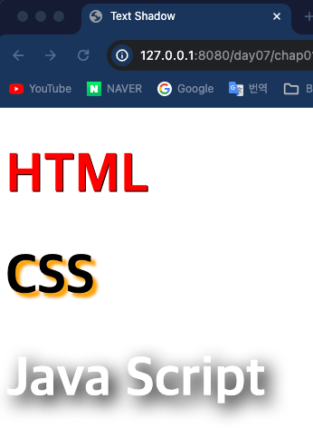
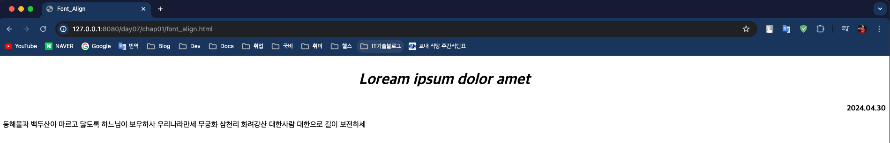
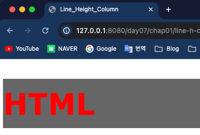

## Front-Eed 학습

### 7일차 학습내용 정리
> 1. CSS - 폰트 설정
> 2. CSS - 위치 속성
---
### 1. CSS - 폰트 설정
- 폰트 크기를 설정할 때는 `font-size` 속성을 사용한다.
  - 속성값 : `px` , `em` , `large` , `small` 등
- 폰트의 글꼴을 설정할 때는 `font-family` 속성을 사용한다.
  - 속성값 : `글꼴명` , 글꼴명이 두 단어 이상이면 쌍 따옴표로 감싼다(`"Times New Roman"`)
- 폰트의 밑줄같은 효과를 줄 때는 `text-decoration` 속성을 사용한다.
  - 속성값 : `none` , `underline` , `overline` , `line-through` 가 있다.
    ```html
    <!DOCTYPE html>
    <html lang="en">
    <head>
        <meta charset="UTF-8">
        <title>Text_Deco</title>
    </head>
    <body>
    <h1>text=decoration 속성</h1>
    <p style="text-decoration: none">none</p>
    <p style="text-decoration: underline">underline</p>
    <p style="text-decoration: overline">overline</p>
    <p style="text-decoration: line-through">line-through</p>
    </body>
    </html>
    ```
    
- 그림자 효과를 줄려면 `text-shadow` 속성을 이용한다.
  - 기본적으로 가로그림자길이, 세로그림자길이, 그림자색을 속성값으로 받는다.
    ```html
    <!DOCTYPE html>
    <html lang="en">
    <head>
        <meta charset="UTF-8">
        <title>Text Shadow</title>
        <style>
            h1 {
                font-size: 60px;
            }
    
            .shadow1 {
                color: red;
                text-shadow: 1px 1px black;
            }
    
            .shadow2 {
                text-shadow: 5px 5px 3px #ffa500;
            }
            .shadow3{
                color:#fff;
                text-shadow: 7px 7px 20px #000;
            }
            .shadow4 {
                color:transparent; <!-- 투명하게 만든다 -->
            }
        </style>
    </head>
    <body>
    <h1 class="shadow1">HTML</h1>
    <h1 class="shadow2">CSS</h1>
    <h1 class="shadow3">Java Script</h1>
    <div class="shadow4">text-shadow</div>
    </body>
    </html>
    ```
    
- 폰트를 정렬할 때는 `text-align` 속성을 사용한다.
  - 속성값: `start`, `end`, `left`, `right`, `center`, ...
    ```html
    <!DOCTYPE html>
    <html lang="en">
    <head>
        <meta charset="UTF-8">
        <title>Font_Align</title>
        <style>
            .font_big {
                font-size: 2em;
            }
    
            .font_italic {
                font-style: italic;
            }
    
            .font_bold {
                font-weight: bold;
            }
    
            .font_center {
                text-align: center;
            }
    
            .font_right {
                text-align: right;
            }
    
        </style>
    </head>
    <body>
    <p class="font_big font_italic font_bold font_center">Loream ipsum dolor amet</p>
    <p class="font_bold font_right">2024.04.30</p>
    <p>
        동해물과 백두산이 마르고 닳도록
        하느님이 보우하사 우리나라만세
        무궁화 삼천리 화려강산
        대한사람 대한으로 길이 보전하세
    </p>
    </body>
    </html>
    ```
    
- 텍스트를 세로정렬을 할때는 `line-height` 속성을 사용하고 속성값은 `height` 값과 같게 해주면 된다.
    ```html
    <!DOCTYPE html>
    <html lang="en">
    <head>
        <meta charset="UTF-8">
        <title>Line_Height_Column</title>
        <style>
            h1 {
                font-size: 60px;
                font-family: Verdana, Tahoma, sans-serif;
            }
    
            .heading {
                width: 100%;
                height: 100px;
                background-color: #666;
                color: rgb(255, 0, 0);
                line-height: 100px;
            }
        </style>
    </head>
    <body>
    <h1 class="heading">HTML</h1>
    </body>
    </html>
    ```
    
---
### 2. CSS - 위치 속성
> 설명이 미비해서 외부 자료를 참고하자 !! [외부자료](https://www.w3schools.com/css/css_positioning.asp)