## Front-Eed 학습

### 8일차 학습내용 정리
> 1. CSS - 단위 
> 2. rm / rem 학습 - 외부 css
> 3. 반응형 웹 Layout - Flex
> 4. 반응형 웹 Layout - Grid

---
### 1. CSS - 단위
> `%` , `em`, `rem` 등등이 있다.

#### CSS 단위 적용 기준
1. **부모요소에 따라서** 사이즈가 변경되어야 하는 경우 : `%` , `em`
   - 그렇지 않을 경우 : 뷰포트 , `rem`
2. **요소의 너비 또는 높이에 따라서** 사이즈가 변경되어야 하는 경우 : `%` , `뷰포트`
   - 폰트에 따라서 크기가 변경될 경우에는 `em`, `rem`

#### `em` vs `rem`
- `rem` 은 **루트 요소에 있는 폰트 사이즈**에 따라서 크기가 결정된다.
- `em` 은 **부모 요소의 폰트 사이즈**에 따라서 크기가 결정된다.
---
### 2. rm / rem 학습 - 외부 css
- 기존의 CSS 는 `<head>` 안에 `<style>` 태그를 이용하여 스타일을 지정했다.
- 하지만 CSS 파일을 외부에서 관리하는 방법도 있다.
  - `<link rel="stylesheet" href="css파일경로">` 이 코드를 `<head>`안에 적어주면 된다.
    ```html
    <!doctype html>
    <html lang="en">
    <head>
        <meta charset="UTF-8">
        <meta name="viewport" content="width=device-width, user-scalable=no, initial-scale=1.0, maximum-scale=1.0, minimum-scale=1.0">
        <meta http-equiv="X-UA-Compatible" content="ie=edge">
        <title>Em&Rem Study</title>
    
        <link rel="stylesheet" href="./em.css"/>
    </head>
    <body>
    <div class="level1">
        <h1>Level 1</h1>
        <div class="level2">
            <h1>Level 2</h1>
            <div class="level3">
                <h1>Level 3</h1>
                <div class="level4">
                    <h1>Level 4</h1>
                </div>
            </div>
        </div>
    </div>
    </body>
    </html>
    ```
    ```css
    .level1 {
    font-size: 2em;
    }
    
    .level2 {
    font-size: 2em;
    }
    
    .level3 {
    font-size: 2em;
    }
    
    .level4 {
    font-size: 2em;
    }
    ```
    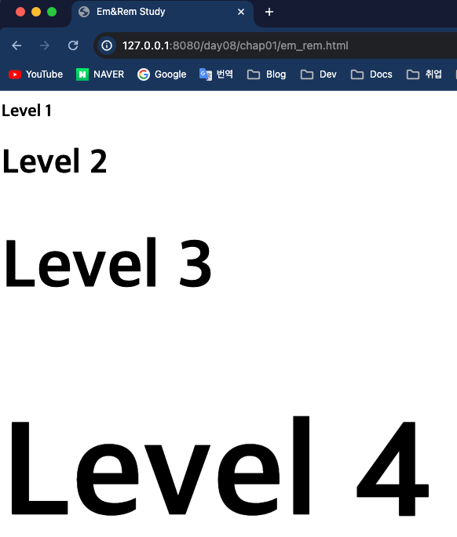
- `rem` 은 `rm` 과 다르게 루트요소에 따라서 정해진다.
    ```html
    <!doctype html>
    <html lang="en">
    <head>
        <meta charset="UTF-8">
        <meta name="viewport" content="width=device-width, user-scalable=no, initial-scale=1.0, maximum-scale=1.0, minimum-scale=1.0">
        <meta http-equiv="X-UA-Compatible" content="ie=edge">
        <title>Em&Rem Study</title>
    
        <link rel="stylesheet" href="rem.css"/>
    </head>
    <body>
    <div class="level1">
        <h1>Level 1</h1>
        <div class="level2">
            <h1>Level 2</h1>
            <div class="level3">
                <h1>Level 3</h1>
                <div class="level4">
                    <h1>Level 4</h1>
                </div>
            </div>
        </div>
    </div>
    </body>
    </html>
    ```
    ```css
    .level1 {
        font-size: 32px;
    }
    
    .level2 {
        font-size: 32px;
    }
    
    .level3 {
        font-size: 32px;
    }
    
    .level4 {
        font-size: 32px;
    }
    
    ```
  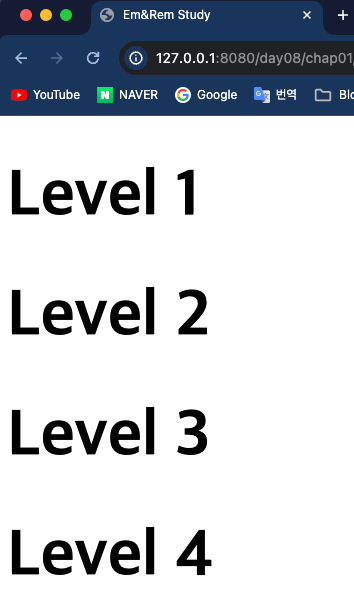
---
### 3. 반응형 웹 Layout - Flex
> 반응형 웹이 나오기 전에는 고전적인 layout 방법은 `position` , `float` , `table` 등을 사용했다.<br>
> 반응형 웹이 나온 이후로는 `flex` 와 `grid` 를 사용했다. -> CSS 의 핵심
#### Flex
- `FlexBox` 를 사용하면 **위치를 지정하지 않고도 유여한 반응형 레이아웃 구조를 디자인** 할 수 있다.
- 즉, FlexBox 안에 요소들을 넣어 위치를 디자인하는 것이다.
- Flex 의 속성은 다음과 같다.
  - `flex-direction` : 컨테이너(플렉스박스)가 내부 요소들의 배치 방향을 정의한다.
    - 속성값 : `column-reverse` , `row` , `row-reverse` 등등
  - `flex-wrap` : 컨테이너 내부 요소들을 래핑할지 여부를 정의한다.
    - 속성값 : `wrap` , `nowrap` , `wrap-reverse` 등등
  - `flex-flow` : 위에 있는 `flex-direction` 과 `flex-wrap` 속성을 한꺼번에 설정하는 단축속성이다.
  - `justify-content` : 요소들의 수평정렬을 정의한다.
    - `center` : 컨테이너 중앙 정렬
    - `flex-start` : 컨테이너 시작 부분부터 정렬
    - `flex-end` : 컨테이너 끝 부분부터 정렬
    - `space-around` : 컨테이너의 요소들과 일정한 간격을 두어 정렬
      
      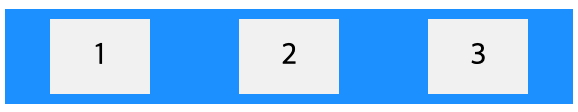
    - `space-between` : 요소 사이의 공백이 있게 정렬
      
      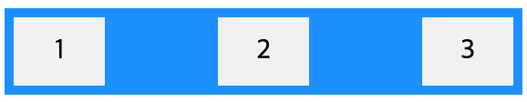
  - `align-items` : `justify-content` 속성과 다르게 수직 정렬을 정의한다.
    - 속성값 : `center`, `flex-start`, `flex-end`, `stretch` 등등
    - `stretch` : 요소를 늘려 컨테이너를 채운다.
      
      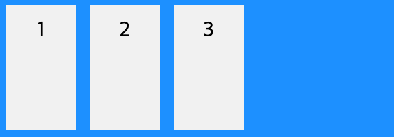
  - `align-content` : `align-itmes`와 유사하지만 라인을 정렬한다.
    - 속성값 : `space-between`, `space-around`, `stretch`, `center` 등
    - `align-content : center;` 는 아래와 같다.
    
      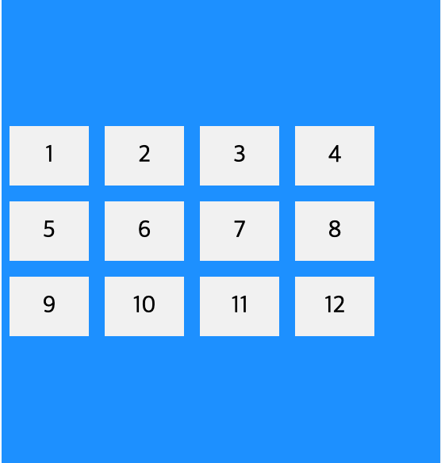
- 컨테이너의  `height` 속성값을 `100vh` 로 지정하면 `viewport` 기준으로 100% 채운다. 
    ```html
    <!doctype html>
    <html lang="en">
    <head>
        <meta charset="UTF-8">
        <meta name="viewport" content="width=device-width, user-scalable=no, initial-scale=1.0, maximum-scale=1.0, minimum-scale=1.0">
        <meta http-equiv="X-UA-Compatible" content="ie=edge">
        <title>CSS-Flex Example</title>
        <link rel="stylesheet" href="basic_style.css">
        <link rel="stylesheet" href="flex.css">
    </head>
    <body>
    <div>
        <div class="container">
            <div class="item">item 1</div>
            <div class="item">item 2</div>
            <div class="item">item 3</div>
            <div class="item">item 4</div>
            <div class="item">item 5</div>
            <div class="item">item 6</div>
            <div class="item">item 7</div>
            <div class="item">item 8</div>
            <div class="item">item 9</div>
            <div class="item">item 10</div>
        </div>
    </div>
    </body>
    </html>
    ```
    ```css
    .container{
        background: beige;
        height: 100vh;
    
        display: flex;
        flex-direction: column-reverse;
        flex-wrap: nowrap;
    }
    ```
  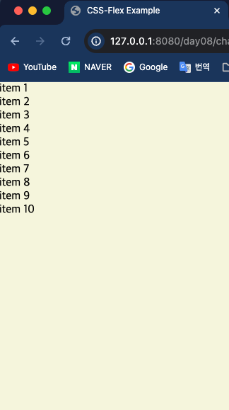
- 그리고 `flex box` 의 `height` 가 100% 로 하면 **요소들의 영역을 기준으로 100% 가 적용**된다.
    ```css
    .container{
        background: aquamarine;
        height: 100%;
    }
    ```
  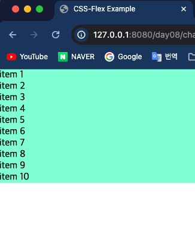

#### 예제
- 총 10개의 `<div>` 요소가 있고 10개의 요소들을 `container` 라는 클래스값의 `<div>`로 묶는다.
  ```html
  <!doctype html>
  <html lang="en">
  <head>
      <meta charset="UTF-8">
      <meta name="viewport" content="width=device-width, user-scalable=no, initial-scale=1.0, maximum-scale=1.0, minimum-scale=1.0">
      <meta http-equiv="X-UA-Compatible" content="ie=edge">
      <title>CSS-Flex Example</title>
      <link rel="stylesheet" href="basic_style.css">
      <link rel="stylesheet" href="flex.css">
  </head>
  <body>
  <div>
      <div class="container">
          <div class="item item1">item 1</div>
          <div class="item item2">item 2</div>
          <div class="item item3">item 3</div>
          <div class="item item4">item 4</div>
          <div class="item item5">item 5</div>
          <div class="item item1">item 6</div>
          <div class="item item2">item 7</div>
          <div class="item item3">item 8</div>
          <div class="item item4">item 9</div>
          <div class="item item5">item 10</div>
      </div>
  </div>
  </body>
  </html>
  ```
- 그리고 기본 css 파일은 아래와 같다.
  ```css
  * {
      box-sizing: border-box;
  }
  
  body {
      width: 100vw;
      height: 100vh;
      margin: 0;
  }
  
  .item {
      display: flex;
  }
  ```
- 플렉스를 지정하기 위해 아래와 같이 css 를 사용했다.
  ```css
  .container {
      background: beige;
      height: 100vh;
  
      display: flex;
      flex-direction: row;
      flex-wrap: wrap;
      justify-content: space-around;
  }
  
  .item1 {
      background-color: aquamarine;
      width: 100px;
      height: 100px;
      align-items: center;
      border:1px solid black;
      justify-content: center;
  }
  .item2 {
      background-color: #ffa500;
      width: 100px;
      height: 100px;
      align-items: center;
      border:1px solid black;
      justify-content: center;
  }
  .item3 {
      background-color: aliceblue;
      width: 100px;
      height: 100px;
      align-items: center;
      border:1px solid black;
      justify-content: center;
  }
  .item4 {
      background-color: blueviolet;
      width: 100px;
      height: 100px;
      align-items: center;
      border:1px solid black;
      justify-content: center;
  }
  .item5 {
      background-color: cornflowerblue;
      width: 100px;
      height: 100px;
      align-items: center;
      border:1px solid black;
      justify-content: center;
  }
  ```
  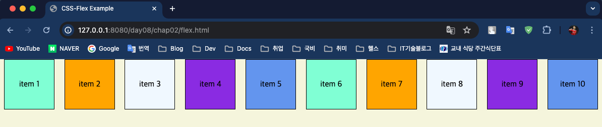
  > [참고자료](https://www.w3schools.com/css/css3_flexbox.asp)
---
### 4. 반응형 웹 Layout - Grid
> `Gird` 레이아웃은 행과 열이 있는 그리드 기반 레이아웃 시스템으로, 위치값을 지정하지 않고 유연하게 웹 페이지를 디자인할 수 있게 해준다.

#### 선언 방법
- `display:grid;` 를 선언하여 컨테이너를 그리드 컨테이너로 정의한다.

#### Grid Columns & Rows
- 그리드 요소들의 세로를 열이라 한다.
  
  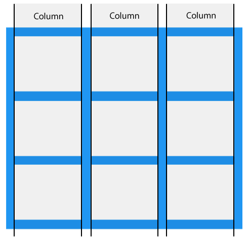
- 그리드 요소들의 가로를 행이라 한다.

  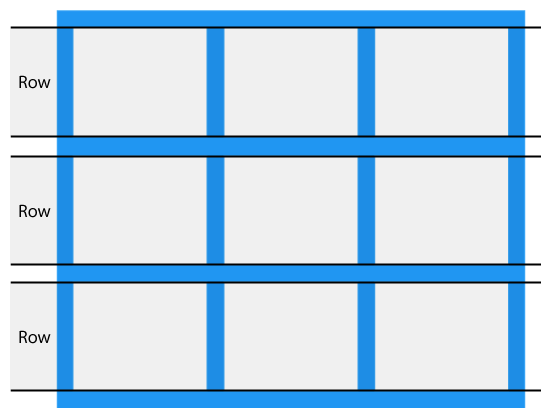

#### Grid Gaps
- 각 행/열 사이의 간격을 Gap 이라 한다.
- 다음 속성 중 하나를 사용하여 간격 크기를 조정한다.
  - `column-gap`
  - `row-gap`
  - `gap`
- 만약 9개의 그리드 요소가 있을 때 `gap: 50px 100px` 를 선언하면 각 행 간의 간격을 50px, 각 열 간의 간격을 100px로 지정한다.

  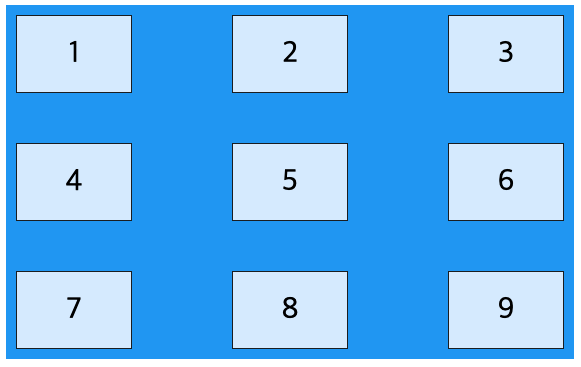

#### Grid Lines
- 행과 행 사이의 선을 행성 이라 하고 열과 열 사이의 선을 열선이라 한다.

  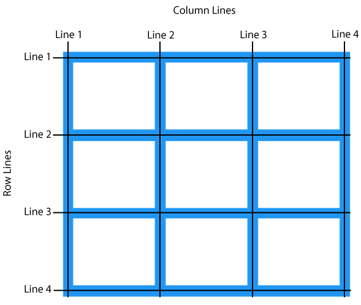
- 만약 9 개의 그리도 요소가 있으면 행과 열 선들은 총 4개씩 있다.
- `grid-column-start:1; grid-column-end:3;` 을 선언하면 1번 열선에 하나 배치하고 3번 열선에 하나 배치한다.

  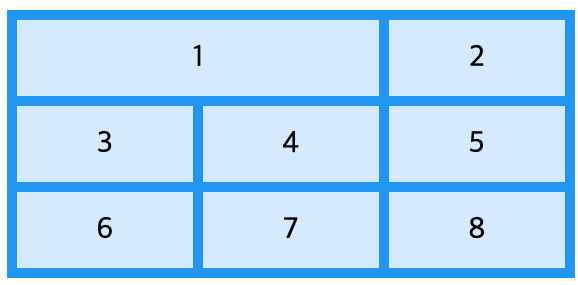
- `grid-column-start: 1; grid-column-end: 3;` 을 선언하면 1번 행선에 하나 배치하고 3번 행선에 하나 배치한다.

  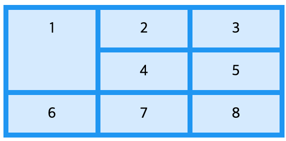

#### 특정 영역으로 Grid 배치하기
- grid-template-areas 라는 속성으로 특정 그리드 요소마다 알파벳을 부여하여 원하는 모양으로 배치가 가능하다.
  ```html
  <!doctype html>
  <html lang="en">
  <head>
      <meta charset="UTF-8">
      <meta name="viewport" content="width=device-width, user-scalable=no, initial-scale=1.0, maximum-scale=1.0, minimum-scale=1.0">
      <meta http-equiv="X-UA-Compatible" content="ie=edge">
      <title>Image</title>
  
      <link rel="stylesheet" href="image.css">
  </head>
  <body>
      <section class="container">
          
          
          
          
          
          
          
      </section>
  </body>
  </html>
  ```
  ```css
  body {
      padding: 1rem;
      background-color: black;
  }
  
  .container {
      display: grid;
      grid-template-columns: repeat(3, 1fr);
      grid-auto-rows: 150px;
      grid-gap: 1rem;
  
      grid-template-areas:
      'a a a'
      'b c c '
      'b d g'
      'e f g'
  }
  
  .image {
      width: 100%;
      height: 100%;
      object-fit: cover;
  }
  
  .image1 {grid-area: a;}
  .image2 {grid-area: b;}
  .image3 {grid-area: c;}
  .image4 {grid-area: d;}
  .image5 {grid-area: e;}
  .image6 {grid-area: f;}
  .image7 {grid-area: g;}
  ```
  

- [참고자료](https://www.w3schools.com/css/css_grid.asp)
---
