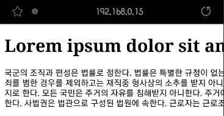
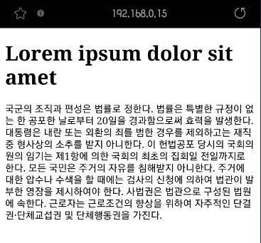
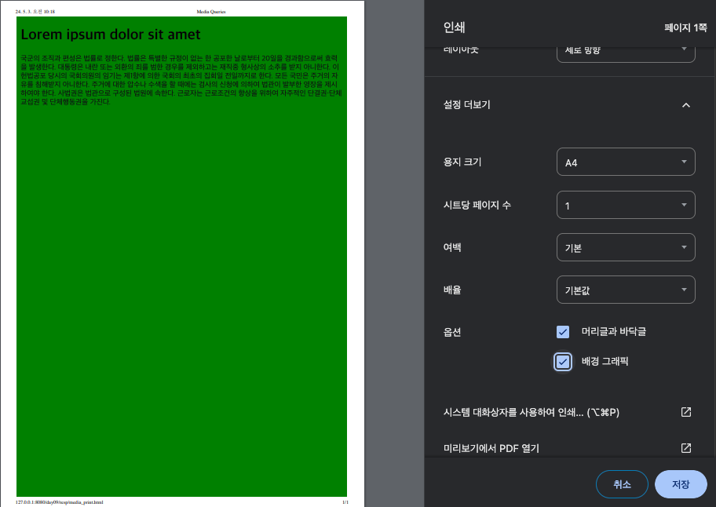
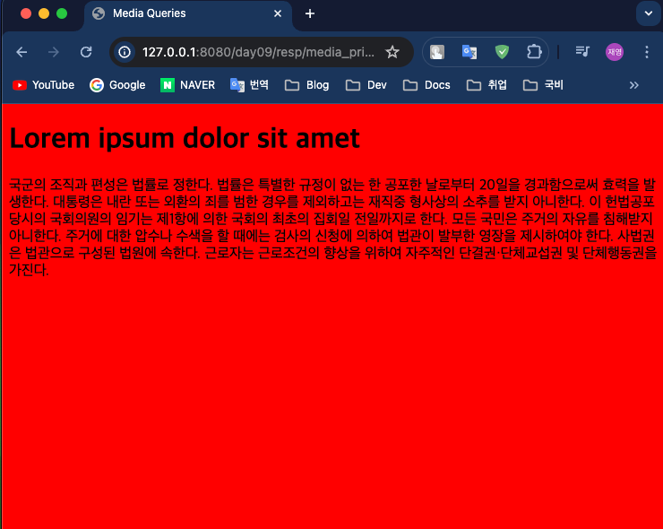
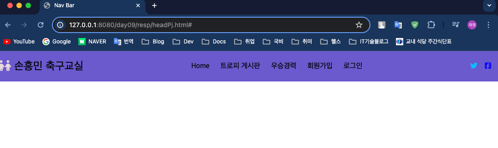
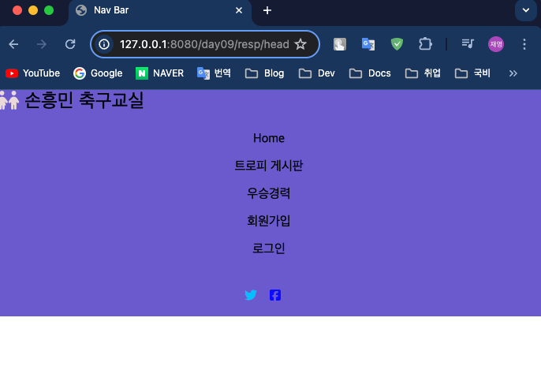

## Front-Eed 학습

### 9일차 학습내용 정리
> 1. CSS - 반응형 웹 Viewport
> 2. CSS - 반응형 웹 Media Query
> 3. CSS - 반응형 웹 Navigation Bar


---
### 1. CSS - 반응형 웹
#### Viewport
- 그냥 일반적으로 html 코드를 짜서 모바일에서 실행해보면 아래와 같이 나온다.
    ```html
    <!doctype html>
    <html lang="en">
    <head>
        <meta charset="UTF-8">
        <title>Viewport</title>
    </head>
    <body>
    <h1>Lorem ipsum dolor sit amet</h1>
    <p>
        국군의 조직과 편성은 법률로 정한다. 법률은 특별한 규정이 없는 한 공포한 날로부터 20일을 경과함으로써 효력을 발생한다. 대통령은 내란 또는 외환의 죄를 범한 경우를 제외하고는 재직중 형사상의 소추를 받지 아니한다. 이 헌법공포 당시의 국회의원의 임기는
        제1항에 의한 국회의 최초의 집회일 전일까지로 한다. 모든 국민은 주거의 자유를 침해받지 아니한다. 주거에 대한 압수나 수색을 할 때에는 검사의 신청에 의하여 법관이 발부한 영장을 제시하여야 한다. 사법권은 법관으로 구성된 법원에 속한다. 근로자는 근로조건의
        향상을 위하여 자주적인 단결권·단체교섭권 및 단체행동권을 가진다.
    </p>
    </body>
    </html>
    ```
  
- 하지만 `viewport` 코드를 넣어주면 화면크기에 맞게 조절된다.
    ```html
    <!doctype html>
    <html lang="en">
    <head>
        <meta charset="UTF-8">
        <meta name="viewport" content="width=device-width, user-scalable=no, initial-scale=1.0, maximum-scale=1.0, minimum-scale=1.0">
        <meta http-equiv="X-UA-Compatible" content="ie=edge">
        <title>Viewport</title>
    </head>
    <body>
    <h1>Lorem ipsum dolor sit amet</h1>
    <p>
        국군의 조직과 편성은 법률로 정한다. 법률은 특별한 규정이 없는 한 공포한 날로부터 20일을 경과함으로써 효력을 발생한다. 대통령은 내란 또는 외환의 죄를 범한 경우를 제외하고는 재직중 형사상의 소추를 받지 아니한다. 이 헌법공포 당시의 국회의원의 임기는
        제1항에 의한 국회의 최초의 집회일 전일까지로 한다. 모든 국민은 주거의 자유를 침해받지 아니한다. 주거에 대한 압수나 수색을 할 때에는 검사의 신청에 의하여 법관이 발부한 영장을 제시하여야 한다. 사법권은 법관으로 구성된 법원에 속한다. 근로자는 근로조건의
        향상을 위하여 자주적인 단결권·단체교섭권 및 단체행동권을 가진다.
    </p>
    </body>
    </html>
    ```
  
- `viewport` 관련 단위는 `vh` 와 `vw`가 있다.
  - `vh` : `viewport height` 
  - `vw` : `viewport width`
---
### 2. CSS - 반응형 웹 Media Query
> `@media` 를 사용하면 데스크톱, 노트북, 태블릿, 휴대폰에 맞춤형 스타일 시트를 제공한다.
#### 미디어 쿼리 기본문법
- 미디어 쿼리 기본 문법은 아래와 같다.
  ```css
  @media not|only mediatype and (media feature) and (media feature) {
    CSS-Code;
  }
  ```
#### 미디어 타입
> 미디어 타입은 `all` , `print` , `screen` 이 있다.

- all 속성은 모든 미디어 유형 장치에 사용된다. 
- print 속성은 인쇄 미리보기 모드에 사용되는 속성이다.(인쇄 -> 설정 더보기 -> 배경그래픽 선택)
  ```css
  @media print{
    body{background-color: green;}
  }
  ```
  
- screen 속성은 화면, 태블릿, 스마트폰 등에 사용하는 속성이다.
  ```css
  @media screen {
      body {
          background-color: red;
      }
  }
  ```
  

#### 공통 미디어 기능
| 값             | 설명                         |
|---------------|----------------------------|
| `orientation` | 뷰포트의 방향(가로 또는 세로)를 지정한다.   |
| `max-height`  | 뷰포트의 최대 높이를 지정한다.          |
| `min-height`  | 뷰포트의 최소 높이를 지정한다.          |
| `height`      | 뷰포트 높이(스크롤 막대를 포함)를 지정한다.  |
| `max-width`   | 뷰포트의 최대 너비를 지정한다.          |
| `min-width`   | 뷰포트의 최소 너비를 지정한다.          |
| `width`       | 뷰포트의 너비(스크롤 막대를 포함)를 지정한다. |
---
### 3. CSS - 반응형 웹 아이콘
- 아이콘은 [외부 라이브러리](https://fontawesome.com/)를 사용했다.
  ```html
  <!doctype html>
  <html lang="en">
  <head>
      <meta charset="UTF-8">
      <meta name="viewport" content="width=device-width, user-scalable=no, initial-scale=1.0, maximum-scale=1.0, minimum-scale=1.0">
      <meta http-equiv="X-UA-Compatible" content="ie=edge">
      <title>Nav Bar</title>
      <link rel="stylesheet" href="https://cdnjs.cloudflare.com/ajax/libs/font-awesome/6.5.2/css/all.min.css"
            integrity="sha512-SnH5WK+bZxgPHs44uWIX+LLJAJ9/2PkPKZ5QiAj6Ta86w+fsb2TkcmfRyVX3pBnMFcV7oQPJkl9QevSCWr3W6A==" crossorigin="anonymous"
            referrerpolicy="no-referrer"/>
      <link rel="stylesheet" href="headPj.css">
  </head>
  <body>
  <nav class="navbar">
      <div class="navbar_logo">
          <i class="fa-solid fa-children"></i>
          <a href="#">손흥민 축구교실</a>
      </div>
  
      <ul class="navbar_menu">
          <li><a href="#">Home</a></li>
          <li><a href="#">트로피 게시판</a></li>
          <li><a href="#">우승경력</a></li>
          <li><a href="#">회원가입</a></li>
          <li><a href="#">로그인</a></li>
      </ul>
      <ul class="navbar_icons">
          <li><i class="fa-brands fa-twitter"></i></li>
          <li><i class="fa-brands fa-square-facebook"></i></li>
      </ul>
  </nav>
  </body>
  </html>
  ```
  ```css
  body {
      margin: 0;
  }
  
  a {
      text-decoration: none;
      color: black;
  }
  
  .navbar {
      display: flex;
      justify-content: space-between;
      align-items: center;
      background-color: slateblue;
  }
  
  .navbar_logo {
      font-size: 24px;
      color: rgb(234, 217, 217);
  }
  
  .navbar_menu {
      display: flex;
      list-style: none;
      padding-left: 0;
  }
  
  .navbar_menu li {
      padding: 8px 12px;
  }
  
  .navbar_icons {
      list-style: none;
      display: flex;
      padding: 0 ;
  }
  
  .navbar_icons li:first-child {
      color: deepskyblue;
      margin-right: 16px;
  }
  
  .navbar_icons li:nth-child(2) {
      color: blue;
      margin-right: 16px;
  }
  
  
  .navbar_menu li:hover {
      background-color: azure;
      border: 1px solid black;
      border-radius: 15px;
  }
  
  @media screen and (max-width: 768px) {
      /* 최대 768px 까지는 세로 정렬*/
      .navbar {
          flex-direction: column;
          align-items: flex-start;
      }
  
      .navbar_menu {
          flex-direction: column;
          align-items: center;
          width: 100%;
      }
  
      .navbar_menu li {
          width: 100%;
          text-align: center;
      }
  
      .navbar_icons {
          justify-content: center;
          width: 100%;
      }
  }
  ```
  
- 페이지의 너비를 어느정도 줄이면 세로로 정렬된다.

  
---
